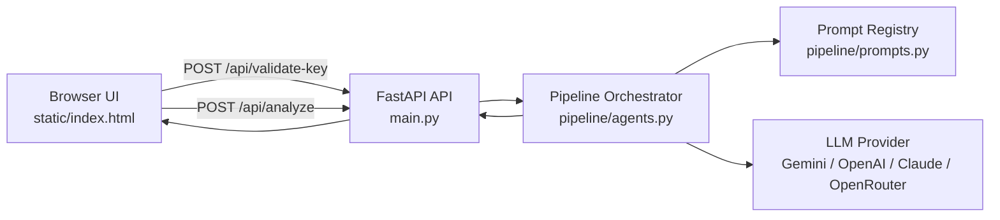

<p align="center">
  
</p>

# BrahmsAI

Clinical decision support prototype for **PCT-guided antibiotic stewardship** using structured patient inputs, serial procalcitonin kinetics, and a four-agent LLM reasoning pipeline.

> **Research only:** BrahmsAI is not a medical device and does not replace clinician judgment.

Project supervision: Claudia Steffen, Sr. Manager for Global Partner and Digital Development, PCT & Licensed Markers at Thermo Fisher Scientific. Contact: claudia.steffen@thermofisher.com.

## Highlights

- PCT threshold interpretation for LRTI and sepsis workflows.
- Serial PCT kinetic tracking with decline calculation and Day 4 treatment-failure alerting.
- Multi-agent pipeline: intake, clinical reasoning, kinetic/context analysis, and final report generation.
- Multi-provider model support for Gemini, OpenAI, Anthropic Claude, and OpenRouter.
- Prompt-injection controls on clinical notes and hardened system prompts.
- Structured JSON output validation, retry handling, timeouts, and pipeline telemetry.
- Local-first FastAPI app with a dependency-free single-file frontend.

## Documentation

[docs/DESIGN.md](docs/DESIGN.md)

Contents:

- Runtime architecture
- API contracts
- Pydantic schemas
- A1-A4 agent responsibilities
- Clinical threshold logic
- LLM provider routing
- Prompt-injection protections
- Error handling
- Observability and metadata
- Security considerations
- Testing and benchmark strategy

## Architecture



## Quick Start

```bash
python3 -m venv .venv
source .venv/bin/activate
pip install -r requirements.txt
uvicorn main:app --host 127.0.0.1 --port 8000
```

Open:

```text
http://localhost:8000
```

The UI asks for a model API key at startup. The key is kept in browser memory for the current session and sent to the local FastAPI backend for provider calls.

## Environment Fallback

For Gemini-only fallback without using the UI key gate:

```bash
cp .env.example .env
# edit .env and set GEMINI_API_KEY
uvicorn main:app --host 127.0.0.1 --port 8000
```

Never commit real API keys, `.env` files, shell history with credentials, or credential-bearing Git remote URLs.

## Main API Endpoints

| Endpoint | Method | Purpose |
|---|---:|---|
| `/` | `GET` | Serves the BrahmsAI frontend |
| `/api/validate-key` | `POST` | Detects and validates model provider access |
| `/api/analyze` | `POST` | Runs the stewardship pipeline |
| `/health` | `GET` | Process health check |

## Project Layout

```text
.
├── main.py
├── pipeline/
│   ├── agents.py
│   ├── prompts.py
│   ├── rate_limiter.py
│   └── schemas.py
├── static/
│   └── index.html
├── benchmarks/
│   ├── benchmark_cases.py
│   ├── benchmark_runner.py
│   └── openrouter_test.py
├── docs/
│   ├── DESIGN.md
│   └── assets/brand/
├── requirements.txt
└── README.md
```

## Security Notes

BrahmsAI is currently designed as a local-first prototype.

Before deploying publicly:

- Restrict CORS to trusted origins.
- Add authentication and authorization.
- Use HTTPS.
- Avoid passing user API keys through an unauthenticated public backend.
- Review clinical data handling requirements for the target environment.
- Move deterministic clinical thresholds into tested backend code if using beyond research/demo workflows.

## License

No license file is currently included. Add one before distributing or accepting external contributions.
